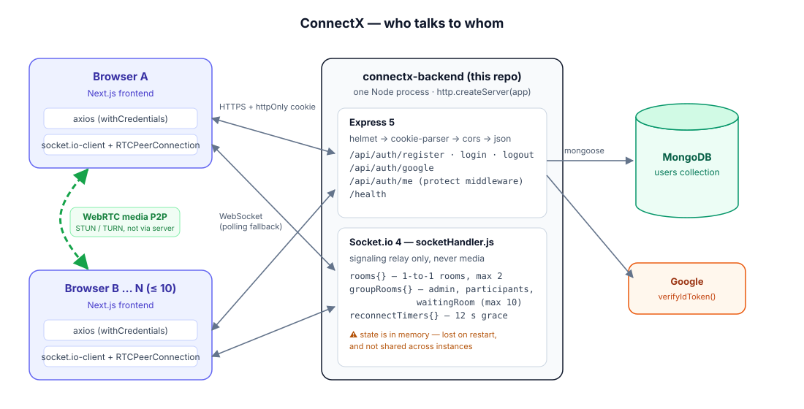
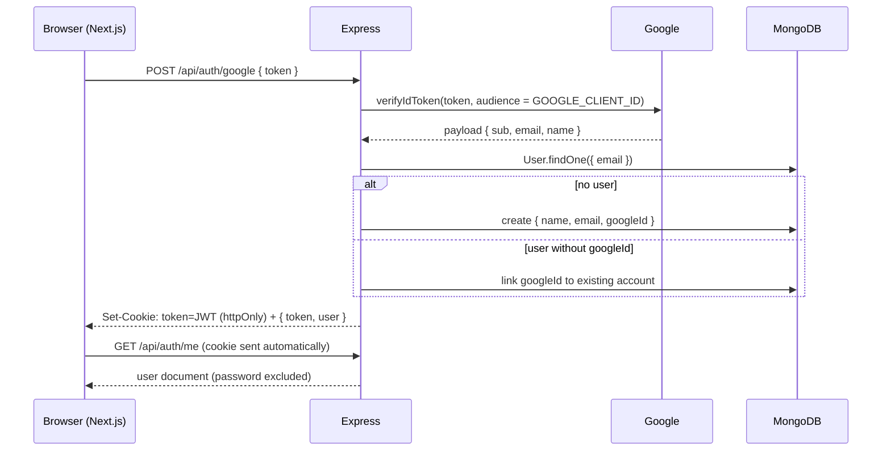
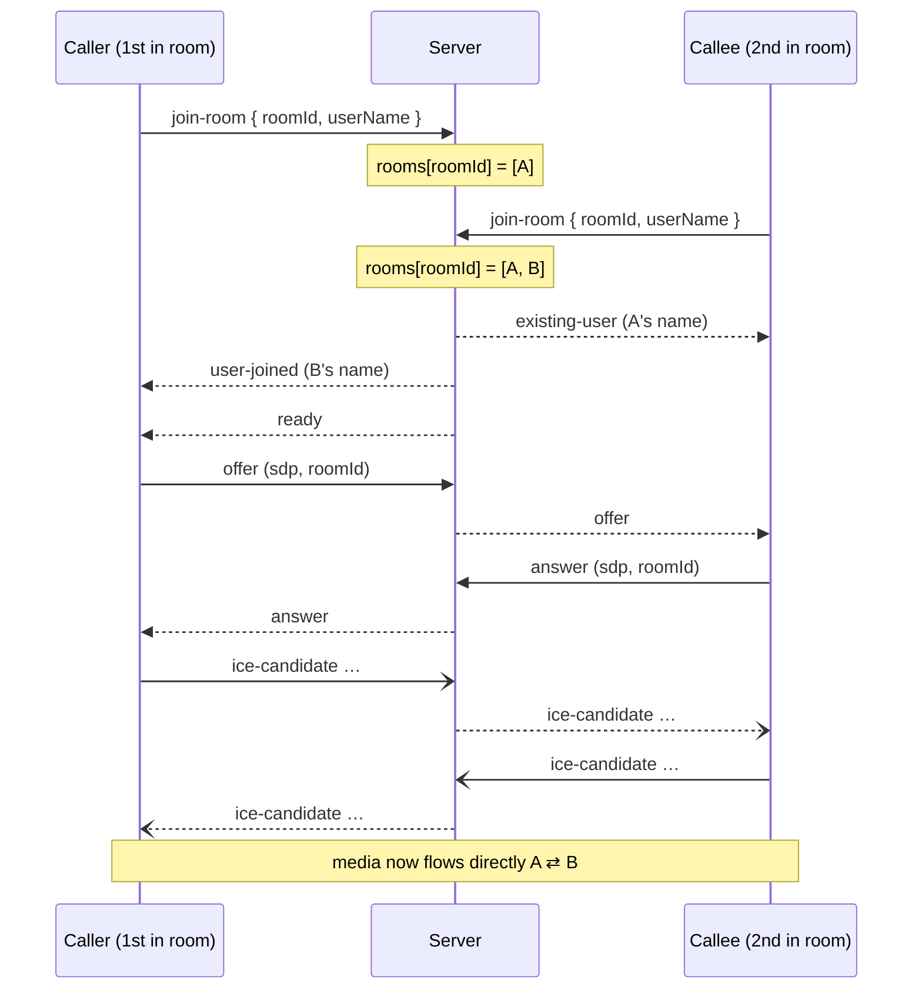
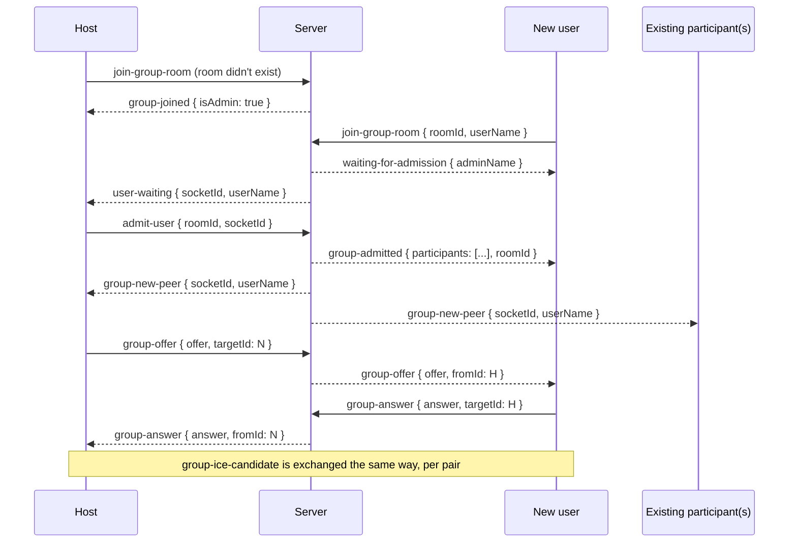
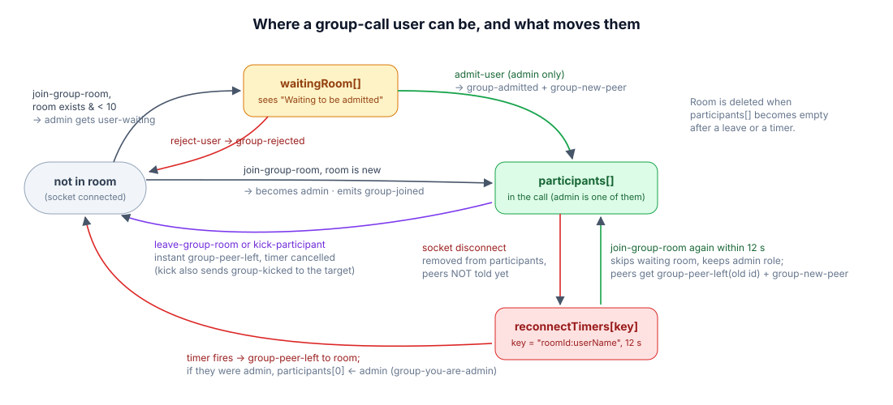

# ConnectX Backend

Express + Socket.io server for **ConnectX**, a browser video-calling app with 1-to-1 calls and group calls of up to 10 people.

This server does three jobs:

1. **Accounts.** It handles email/password and Google sign-in, and issues a JWT in an httpOnly cookie.
2. **Signaling.** It relays WebRTC offers, answers and ICE candidates between browsers so they can connect directly.
3. **Room control.** It runs the group waiting room, host admission, mute-all, kick, and reconnect recovery.

Audio and video never pass through this server. They flow browser-to-browser over WebRTC.

> **Frontend repo:** [connectx-frontend](https://github.com/rishabhchowkikar/connectx-frontend). It's a Next.js 16 app that uses every endpoint and event described here.

<p align="center">
  
</p>

---

## Table of Contents

- [Tech Stack](#tech-stack)
- [Project Structure](#project-structure)
- [Environment Variables](#environment-variables)
- [Getting Started](#getting-started)
- [Authentication (REST API)](#authentication-rest-api)
- [Real-Time Signaling (Socket.io)](#real-time-signaling-socketio)
  - [Server configuration](#server-configuration)
  - [1-to-1 rooms](#1-to-1-rooms)
  - [Group rooms](#group-rooms)
  - [Group room lifecycle](#group-room-lifecycle)
  - [Reconnect & blackout recovery](#reconnect--blackout-recovery)
  - [Host controls: admit, reject, mute all, kick](#host-controls-admit-reject-mute-all-kick)
  - [Join / leave notifications](#join--leave-notifications)
  - [Event reference](#event-reference)
- [Database Model](#database-model)
- [Security](#security)
- [Docker](#docker)
- [Known limitations](#known-limitations)
- [Changelog (feature history)](#changelog-feature-history)

---

## Tech Stack

| Tool | Version | Purpose |
|------|---------|---------|
| Node.js | 18+ | Runtime (Docker image uses `node:18-alpine`) |
| Express | ^5.2.1 | HTTP server and REST API |
| Socket.io | ^4.8.3 | WebSocket signaling server |
| Mongoose | ^9.2.1 | MongoDB ODM |
| jsonwebtoken | ^9.0.3 | JWT signing / verification |
| bcryptjs | ^3.0.3 | Password hashing |
| google-auth-library | ^10.6.1 | Server-side Google ID-token verification |
| helmet | ^8.1.0 | Security headers |
| cors | ^2.8.6 | Cross-origin policy (credentialed) |
| cookie-parser | ^1.4.7 | Reads the `token` cookie |
| dotenv | ^17.3.1 | Loads `.env` |
| nodemon | ^3.1.14 (dev) | Auto-reload in development |

---

## Project Structure

```
connectx-backend/
├── index.js                            # Express app + HTTP server + Socket.io server
├── socket/
│   └── socketHandler.js                # ALL real-time logic: 1-to-1 + group rooms
├── routes/
│   └── authRoutes.route.js             # /api/auth/* routes (and the /me handler)
├── controllers/
│   └── authController.controller.js    # register, login, logout, googleAuth
├── middlewares/
│   └── authMiddleware.js               # `protect` — verifies the JWT
├── models/
│   └── User.model.js                   # User schema, bcrypt pre-save hook
├── config/
│   └── db.js                           # mongoose.connect(MONGO_URI), exits on failure
├── docs/images/                        # Diagrams used in this README
├── Dockerfile
└── package.json
```

---

## Environment Variables

Create a `.env` file in the project root (it is git-ignored):

```env
# Port the HTTP + WebSocket server listens on (default 5001)
PORT=5001

# "production" switches cookies to Secure + SameSite=None
NODE_ENV=development

# Exact origin of the frontend — used for BOTH Express CORS and Socket.io CORS
FRONTEND_URL=http://localhost:3000

# MongoDB connection string
MONGO_URI=mongodb+srv://<user>:<password>@<cluster>.mongodb.net/<db>

# Secret used to sign/verify JWTs — use a long random string
JWT_SECRET=change_me

# Google OAuth Web Client ID (must match NEXT_PUBLIC_GOOGLE_CLIENT_ID in the frontend)
GOOGLE_CLIENT_ID=xxxxxxxx.apps.googleusercontent.com
```

> `FRONTEND_URL` must be an exact origin like `https://app.example.com`, not `*`. The browser rejects a wildcard origin on credentialed (cookie) requests.

---

## Getting Started

```bash
npm install

# development — auto-reloads with nodemon
npm run dev

# production (there is no "start" script; run node directly)
node index.js
```

The server listens on `0.0.0.0:$PORT` and logs `Server running on port …` and `MongoDB connected`. If MongoDB can't be reached, the process exits with code 1.

Health check:

```bash
curl http://localhost:5001/health     # → {"message":"OK"}
```

---

## Authentication (REST API)

All auth routes are mounted at `/api/auth`. Every successful sign-in path ends the same way:

1. Sign a JWT whose payload is `{ id, name, email }`, using `JWT_SECRET`, expiring in **1 hour**.
2. Set it as the `token` cookie.
3. Return `{ token, user: { id, name, email } }`.

**Cookie options** (`authController.controller.js`):

| Option | Development | Production (`NODE_ENV=production`) |
|---|---|---|
| `httpOnly` | `true` | `true` |
| `secure` | `false` | `true` |
| `sameSite` | `Lax` | `None` (frontend and backend on different domains) |
| `maxAge` | 1 hour | 1 hour |



### `POST /api/auth/register`

Body: `{ name, email, password }`

- `400 { msg: "User already exists" }` if the email is taken.
- The password is hashed by the model's pre-save hook, not by the controller.
- Schema validation: name ≥ 2 chars, valid email, password ≥ 6 chars. A validation failure returns `500 { msg: "Server error", error }`.

### `POST /api/auth/login`

Body: `{ email, password }`

- Looks up the user by email, then calls `user.matchPassword(password)`.
- `401 { msg: "Invalid credentials" }` on unknown email or wrong password. Accounts created only through Google have no password, so `matchPassword` always returns `false` for them.

### `POST /api/auth/google`

Body: `{ token }`, the Google ID token (`credential`) returned by the Google button.

- `400` if `token` is missing.
- Verifies the token **server-side** with `OAuth2Client.verifyIdToken` against `GOOGLE_CLIENT_ID`.
- Handles three cases:
  - **New user:** creates the account with no password.
  - **Existing email without `googleId`:** links the Google account to it.
  - **Existing Google user:** signs in.
- `401 { msg: "Invalid or expired Google token" }` on any verification error.

### `POST /api/auth/logout`

Clears the `token` cookie (same `secure`/`sameSite` flags it was set with) → `200 { msg: "Logged Out Successfully" }`.

### `GET /api/auth/me` (protected)

`protect` middleware (`middlewares/authMiddleware.js`):

- Reads the token from the **`x-auth-token` header** or the **`token` cookie**.
- `401 { msg: "No token, authorization denied" }` if the token is missing, or `401 { msg: "Token is not valid" }` if verification fails.
- On success, puts the decoded payload on `req.user`.

The handler returns `User.findById(req.user.id).select('-password')`. The frontend calls this on every page load to decide whether the user is logged in.

### `GET /health`

`200 { message: "OK" }`.

---

## Real-Time Signaling (Socket.io)

All socket logic lives in [socket/socketHandler.js](socket/socketHandler.js). It keeps three in-memory maps:

```js
rooms           = { [roomId]: [{ id: socketId, userName }] }              // 1-to-1, max 2
groupRooms      = { [roomId]: { admin: { id, userName },
                                participants: [{ id, userName }],
                                waitingRoom:  [{ id, userName }] } }       // max 10 participants
reconnectTimers = { ["roomId:userName"]: { timer, oldSocketId, isAdmin } } // 12 s grace windows
```

Each connected socket also remembers `currentRoomId` / `currentGroupRoomId` so `disconnect` knows what to clean up.

### Server configuration

From `index.js`:

| Option | Value | Why |
|---|---|---|
| `cors.origin` | `FRONTEND_URL` | same origin allow-list as Express |
| `transports` | `["websocket", "polling"]` | WebSocket first, long-polling fallback |
| `pingInterval` | `25000` | server heartbeat, same period as the client's 25 s `ping` |
| `pingTimeout` | `20000` | drop the socket if no pong in 20 s |
| `upgradeTimeout` | `30000` | time allowed to upgrade polling → WebSocket |

### 1-to-1 rooms

Room IDs are UUID v4 strings generated by the frontend (`/call/{uuid}`). A room holds **2 people max**.



The details:

- **Only the first person gets `ready`, so only they create the offer.** This avoids "glare", where both sides send offers at once.
- **Stale entries are dropped by name.** Before adding a user, the server removes any existing entry with the same `userName`. A reconnecting socket can arrive before its old socket's `disconnect` fires, and this stops it from bouncing off its own ghost with `room-full`.
- **A third person gets `room-full`.**
- **Chat, typing and reactions go only to the other peer.** `chat-message`, `chat-typing` and `send-reaction` are relayed with `socket.to(roomId)`, so the sender never gets an echo. The server first checks that the sender is actually in `rooms[roomId]`. Reactions arrive at the other side as `receive-reaction`.
- **On disconnect, the leaver is removed immediately.** The other peer gets `user-disconnected`, and an empty room is deleted. When that peer comes back, the normal `join-room` flow runs again. The remaining user gets `ready`, rebuilds the peer connection, and the call resumes.

### Group rooms

Group room IDs are `group_<uuid>`, served under `/group-call/{roomId}`. The **first person to join a room becomes its admin (host)**. Everyone after them waits in a waiting room until the host lets them in. A room holds at most **10 participants** (`MAX_GROUP_PARTICIPANTS`).

The call uses a **full mesh**: every participant holds one `RTCPeerConnection` to every other participant. To support this, group signaling is **addressed to one socket** (`targetId`) instead of broadcast to the room. The server stamps each relayed message with `fromId` so the receiver knows which peer connection it belongs to.



**Existing members send the offers.** When someone is admitted, each existing participant gets `group-new-peer` and creates an offer to the newcomer. The newcomer only answers.

The server protects `join-group-room` in three ways:

- A socket that is already a participant, or already waiting, is ignored. This stops double-joins when the client re-emits.
- If `participants.length >= 10`, the joiner gets `group-room-full`.
- Chat, typing, reactions and raise-hand are ignored unless the sender is in `participants`.

### Group room lifecycle

<p align="center">
  
</p>

**Admin hand-off.** The admin can leave by clicking Leave, or by disconnecting and not returning within 12 s. Either way, `participants[0]` (the longest-standing remaining member) becomes admin and receives `group-you-are-admin`. The room is deleted once `participants` is empty.

### Reconnect & blackout recovery

A mobile browser that goes to the background, a Wi-Fi switch, or a short network blackout all drop the socket. This doesn't necessarily mean the user wants to leave. So a **group** disconnect is not final right away:

1. On `disconnect`, the user is removed from `participants` right away, so room state stays consistent. **The other peers are not notified yet.**
2. A 12-second timer (`RECONNECT_GRACE_MS = 12000`) is stored under `reconnectTimers["roomId:userName"]`, along with the old socket ID and whether they were admin.
3. **If the same `userName` sends `join-group-room` for the same room within 12 s:**
   - The timer is cancelled.
   - The user is put straight back into `participants` with their new socket ID. They skip the waiting room and keep their admin role.
   - They receive `group-admitted` (the current peer list) and `group-joined { isAdmin }`.
   - Every other peer receives **`group-peer-left { socketId: oldSocketId }`**, which removes the frozen "ghost" tile, then **`group-new-peer`** for the new socket. The existing peers then open fresh WebRTC connections to the returning user.
4. **If the timer fires:** everyone gets `group-peer-left`, admin is handed off if needed, and an empty room is deleted.

Users who were still in the waiting room are simply removed on disconnect, with no grace period.

### Host controls: admit, reject, mute all, kick

Every host-only event checks `room.admin.id === socket.id` and silently ignores anyone else.

| Action | Client emits | Server does |
|---|---|---|
| **Admit** | `admit-user { roomId, socketId }` | Moves the user from `waitingRoom` to `participants`, joins their socket to the Socket.io room, sends them `group-admitted`, sends everyone else `group-new-peer`. |
| **Reject** | `reject-user { roomId, socketId }` | Removes them from `waitingRoom` and sends them `group-rejected`. |
| **Mute all** | `group-mute-all { roomId }` | Sends `group-mute-all` to everyone except the host. Each client disables its own mic track. The server can't mute anyone itself, because media never reaches it. |
| **Kick** | `kick-participant { roomId, socketId }` | Removes the target from `participants`, **cancels any reconnect timer for them** so they can't slip back in during the grace window, sends them `group-kicked`, and sends the room `group-peer-left { socketId }` immediately. |

### Join / leave notifications

Leaves are made **instant** wherever the server knows the leave was on purpose:

- **`leave-group-room { roomId }`.** The frontend emits this when the user clicks Leave, just before disconnecting its socket. The server cancels any pending reconnect timer, removes the user from the room, sends `group-peer-left` to the room right away (no 12 s wait), and hands off admin if needed. Without this event, a deliberate leave would sit in the 12 s grace window like a network drop.
- **Kick.** Also sends an instant `group-peer-left`, as described above.
- **Network drops.** These send `group-peer-left` only after the grace timer expires.

The frontend turns `group-new-peer` into a green **"→ Name Joined"** toast and `group-peer-left` into a red **"← Name Left the room"** toast.

### Event reference

#### 1-to-1

| Event | Direction | Payload | Notes |
|---|---|---|---|
| `join-room` | client → server | `{ roomId, userName }` | Join / rejoin a 1-to-1 room |
| `existing-user` | server → 2nd user | `userName` (string) | Name of the person already in the room |
| `user-joined` | server → 1st user | `userName` (string) | Name of the person who just joined |
| `ready` | server → 1st user | — | "Create the offer now" |
| `room-full` | server → joiner | — | Room already has 2 users |
| `offer` | client ⇄ peer | `(offer, roomId)` | Positional args, relayed to the room |
| `answer` | client ⇄ peer | `(answer, roomId)` | Positional args |
| `ice-candidate` | client ⇄ peer | `(candidate, roomId)` | Positional args |
| `chat-message` | client → server → peer | `{ roomId, message, userName, timeStamp }` → `{ message, userName, timeStamp, fromId }` | Not echoed to sender |
| `chat-typing` | client → server → peer | `{ roomId, userName, isTyping }` → `{ userName, isTyping }` | |
| `send-reaction` | client → server | `{ roomId, emoji }` | |
| `receive-reaction` | server → peer | `{ emoji }` | |
| `user-disconnected` | server → remaining peer | — | Other side's socket dropped |

#### Group

| Event | Direction | Payload | Notes |
|---|---|---|---|
| `join-group-room` | client → server | `{ roomId, userName }` | Create, request to join, or reconnect |
| `group-joined` | server → client | `{ isAdmin }` | You are in the call (creator, or reconnect) |
| `waiting-for-admission` | server → joiner | `{ adminName }` | Show the waiting screen |
| `user-waiting` | server → host | `{ socketId, userName }` | Someone is knocking |
| `admit-user` | host → server | `{ roomId, socketId }` | |
| `reject-user` | host → server | `{ roomId, socketId }` | |
| `group-admitted` | server → joiner | `{ participants: [{ socketId, userName }], roomId }` | Current peers |
| `group-rejected` | server → joiner | — | |
| `group-room-full` | server → joiner | — | 10 participants reached |
| `group-new-peer` | server → existing peers | `{ socketId, userName }` | Create an offer to this peer |
| `group-offer` | client → server → target | `{ offer, targetId, roomId }` → `{ offer, fromId, roomId }` | Routed to `targetId` only |
| `group-answer` | client → server → target | `{ answer, targetId, roomId }` → `{ answer, fromId, roomId }` | |
| `group-ice-candidate` | client → server → target | `{ candidate, targetId, roomId }` → `{ candidate, fromId, roomId }` | |
| `group-chat-message` | client → server → others | `{ roomId, message, userName, timeStamp }` → `{ message, userName, timeStamp, fromId }` | |
| `group-chat-typing` | client → server → others | `{ roomId, userName, isTyping }` → `{ userName, isTyping }` | |
| `group-reaction` | client → server → others | `{ roomId, emoji, userName }` → `{ emoji, userName, socketId }` | `socketId` tells receivers which tile to animate |
| `group-raise-hand` | client → server | `{ roomId, userName, isRaised }` | |
| `group-hand-raised` | server → others | `{ socketId, userName, isRaised }` | |
| `group-mute-all` | host → server → others | `{ roomId }` → — | Host only |
| `kick-participant` | host → server | `{ roomId, socketId }` | Host only |
| `group-kicked` | server → kicked user | — | |
| `leave-group-room` | client → server | `{ roomId }` | Intentional leave, instant notification |
| `group-peer-left` | server → room | `{ socketId }` | Remove tile, close that peer connection |
| `group-you-are-admin` | server → new host | — | Admin handed off to you |

---

## Database Model

`models/User.model.js`

| Field | Type | Rules |
|---|---|---|
| `name` | String | required, trimmed, min length 2 |
| `email` | String | required, **unique**, lowercased, trimmed, must match `^\S+@\S+\.\S+$` |
| `password` | String | required **only if `googleId` is not set**; min length 6; stored as a bcrypt hash |
| `googleId` | String | unique + **sparse** (many users may have none) |
| `createdAt` | Date | defaults to `Date.now` |

- **Pre-save hook:** if `password` was modified and is non-empty, it is replaced with `bcrypt.hash(password, genSalt(10))`. It is an async hook, so it doesn't call `next()`.
- **`matchPassword(entered)`:** returns `false` when the user has no password (Google-only account), otherwise `bcrypt.compare`.

Rooms, participants and chat messages are **not** stored in the database. They live only in server memory and in the browsers.

---

## Security

| Concern | How it's handled |
|---|---|
| Token theft via XSS | JWT lives in an **httpOnly** cookie, so page JavaScript can't read it |
| Cross-site requests | `sameSite: Lax` in dev; `None` + `Secure` in production (needed when frontend and backend are on different domains) |
| Forged Google logins | ID token verified server-side against Google's keys and `GOOGLE_CLIENT_ID` |
| Password storage | bcrypt, 10 salt rounds, applied automatically by the model |
| CORS | Single allowed origin (`FRONTEND_URL`) with `credentials: true`, for both Express and Socket.io |
| HTTP headers | `helmet()` defaults, with `crossOriginResourcePolicy: cross-origin` |
| Host-only socket actions | `admit-user`, `reject-user`, `group-mute-all` and `kick-participant` check that the sender is the room admin |
| Room message spoofing | Chat, typing, reactions and raise-hand are dropped unless the sender is a member of that room |

---

## Docker

```bash
docker build -t connectx-backend .

# The image EXPOSEs 10000 (Render's default) — the app itself listens on $PORT
docker run --env-file .env -e PORT=10000 -p 10000:10000 connectx-backend
```

The Dockerfile uses `node:18-alpine`, runs `npm install`, copies the source, and starts with `node index.js`.

---

## Known limitations

These are worth knowing before you scale or extend the server:

- **In-memory state.** `rooms`, `groupRooms` and `reconnectTimers` disappear on restart and aren't shared between instances. Running more than one instance needs sticky sessions plus a shared store, such as the Socket.io Redis adapter.
- **Socket connections aren't authenticated.** The socket handshake doesn't check the JWT, and `userName` comes from the client. The frontend only opens call pages for logged-in users, but the socket server itself trusts the name it's given.
- **Reconnect matching is by display name.** Two people with the same name in one group room would be treated as the same user during the 12 s grace window.
- **Group signaling doesn't check room membership.** `group-offer`, `group-answer` and `group-ice-candidate` are forwarded to any `targetId` without checking that both sockets are in the same room.
- **The `ping` event is ignored.** The client's 25 s `ping` just generates traffic to keep the socket alive. There is no server handler for it.

---

## Changelog (feature history)

Most recent first, from the git history of this repo.

| Commit | Date | Change |
|---|---|---|
| `e5310a6` | 2026-05-03 | **Admin kick** (`kick-participant` → `group-kicked` + instant `group-peer-left`, cancels reconnect timer). The frontend's join/leave toasts shipped alongside and reuse the existing `group-new-peer` / `group-peer-left` events. |
| `b427aa9` | 2026-05-02 | **Intentional leave** (`leave-group-room`): skips the 12 s grace period and notifies peers instantly, with admin hand-off. |
| `79f9126` | 2026-05-02 | **Blackout recovery:** on reconnect, peers get `group-peer-left(oldSocketId)` before `group-new-peer`, removing ghost tiles. |
| `59b6216` | 2026-04-19 | Calls survive socket reconnects: stale 1-to-1 entries removed by `userName` on rejoin; `pingInterval` / `pingTimeout` raised to 25 s / 20 s to match the client heartbeat. |
| earlier | — | 1-to-1 chat, typing indicator and reactions; group rooms with waiting room, host admission, mesh signaling, 12 s reconnect grace, group chat, reactions, raise hand, mute-all; Google OAuth; cookie-based JWT auth. |
